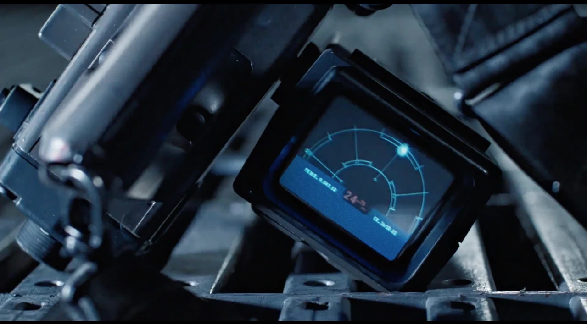
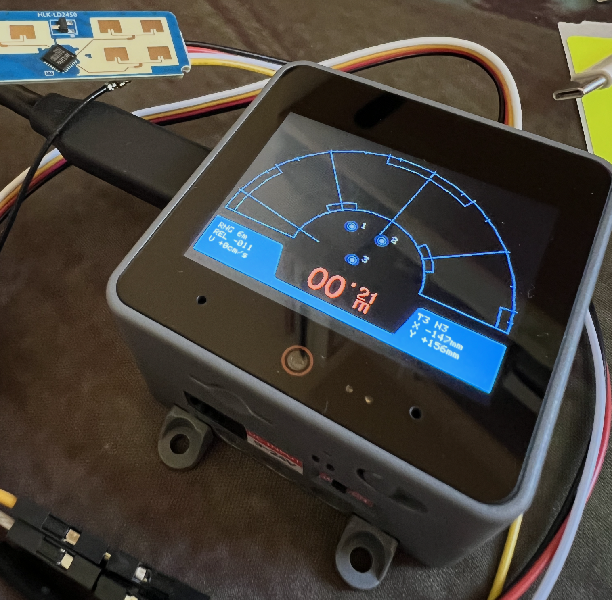

# M314 Motion Tracker 
  
  

This project uses HLK-LD2450 and M5Stack CoreS3 to recreate the M314 Motion Tracker — a piece of USCM equipment featured in the movie *Aliens*.  

It lets you experience the atmosphere of the film "anytime, anywhere"!

---

| LD2450 | CoreS3 PORT.C |
| --- | --- |
| 5V | V（5V） |
| RX | T（TX / GPIO17） |
| TX | R（RX / GPIO18） |
| GND | G（GND） |
